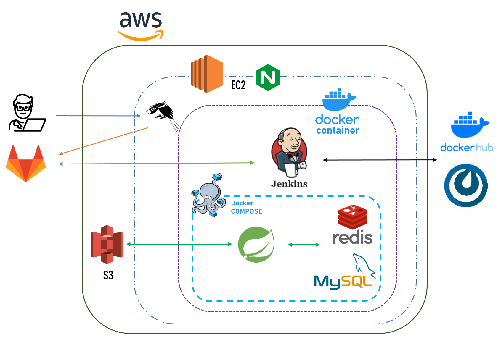
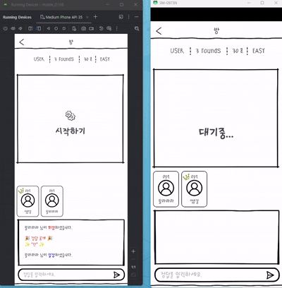
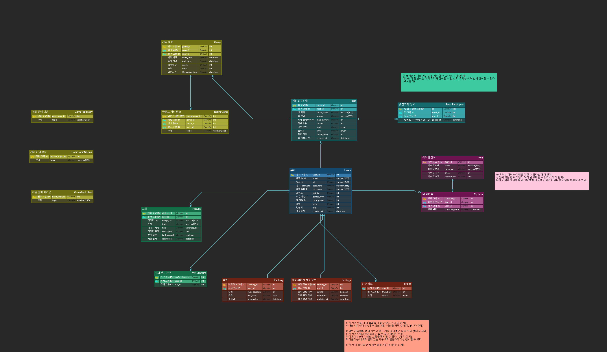
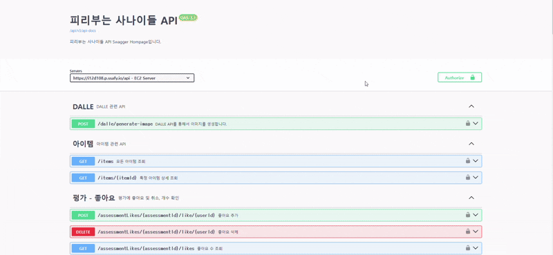
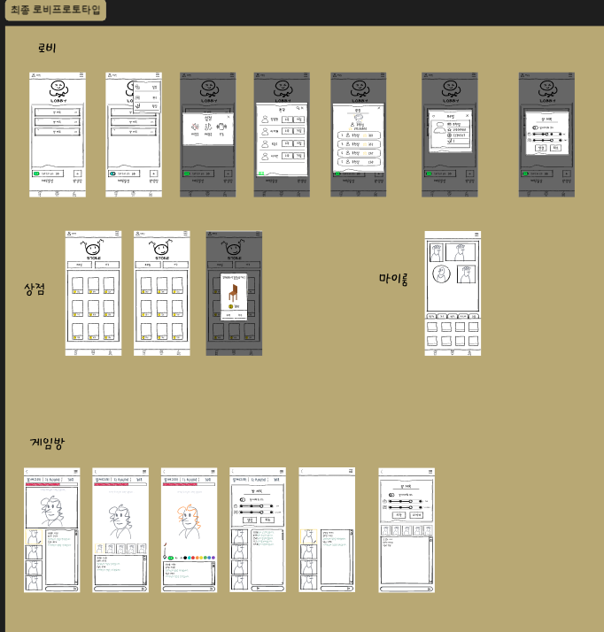

# 니알아서그려라 ✍️🎨
- 일시 : 2025.1.13.(월)  ~ 2025.2.21.(금)
## 📝 프로젝트 개요

### **목적**

- AI가 생성한 그림이나 사용자가 직접 그린 그림의 정답을 맞추는 실시간 멀티플레이 게임을 제공하는 서비스입니다. 
- 참여자는 게임을 통해 퀴즈를 풀고 포인트와 리워드를 획득하며, 다양한 아이템과 기능을 즐길 수 있습니다. 
- 사용자 간 소통과 경쟁을 유도하며, AI 기술을 활용한 창의적이고 흥미로운 게임 환경을 제공합니다.

### 📱서비스 설명
1. **로그인**: JWT를 통한 안전한 로그인 환경 제공
2. **실시간 멀티플레이**: WebSocket 기반의 안정적이고 원활한 게임 환경 제공.
3. **AI 기반의 그림 생성**:
AI를 활용하여 주제, 난이도 등을 기반으로 그림을 생성.
4. **실시간 채팅과 퀴즈**: 참여자 간 실시간 소통 및 정답 맞추기 퀴즈.
5. **마이룸 기능을 통한 차별성**:
마이룸 기능을 통해 그린 그림을 마이룸에 전시하고 구경할 수 있음.

### 🤝 팀원

| 이름        | 담당 영역                                                  |     
| ----------- | ------------------------------------------------------------ |
| 정도현     | - Backend - 프로젝트 총괄 - ERD 설계 - API 개발 - 웹소켓 구현 | 
| 도승국     | - Backend - ERD 설계 - API 개발 - 인프라 구축 - 인증 및 보안 | 
| 이지운     | - Frontend - UI/UX 디자인 설계 총괄 - 마이룸 구현  | 
| 양성원     | - Frontend - 웹소켓 연동(게임방) 총괄 - 로그인 구현 | 
| 송주헌     | - Frontend - 웹소켓 연동(게임방) - 상점 구현 - 회원가입 - 프로필 정보 변경  | 
| 이지현     | - Backend - ERD 설계 - API 개발 - DALL-E API 연동 | 

## 🛠 기술스택 (Tech Stack)
- **Backend**: SpringBoot, SptingSecurity
- **Frontend**: Android Studio(LadyB ug), Kotlin 1.9.21
- **Database**: MySQL, Redis, S3
- **Infra**: Docker, Jenkins, AWS
- **AI 모델**: DALL-E API

## 🗂️ 아키텍처 구성도

## 💡 니 알아서 그려라 실행 화면

### 프로필 변경

- 상점에서 프로필 이미지와 액자등을 구매가능
- 프로필 닉네임과 프로필 이미지를 변경 가능합니다다

### 유저 모드

- 매 라운드 마다 유저에게 턴을 제공
- 턴인 유저는 단어를 선택 후 그림을 그림
- 웹소켓을 통해 그림을 그리는 유저의 drawing data를 참자가 유저들에게 전송 후 표시
- 모든 유저가 정답을 맞추거나 시간이 지나면 정답 공개 후 다음 라운드 진행행 

### AI 모드

- DALL-E api 요청 후 서버에서 보낸 image url을 통해 사진을 표시
- 웹소켓을 통해 모든 유저가 정답을 맞추거나 시간이 지나면 정답 공개 후 다음 사진 요청

### 마이룸

- 유저모드에서 직접 그린 그림을 하단 저장 버튼을 통해 그림을 로컬 핸드폰에 저장장
- 유저가 상점에서 구매한 액자를 바탕으로 직접 그린 그림을 전시
- 유저 친구의 마이룸 방문 시 해당 유저의 마이룸 그림 감상
- 유저의 그림 클릭 시 확대되어 화면에 표시시

##  프로젝트 산출물

### 💾 데이터베이스 모델링(ERD)

### API 명세서 

### API 명세서 (WebSocket)

https://circular-iodine-d32.notion.site/API-5bc2dcde44fd4875a5411757f3a1b5af

- WebScoket 관련 api 명세서는 노션 API 명세서 부분 메소드(Socket)으로 정의된 곳에 모두 정의해 두었습니다.

### 피그마 

 

